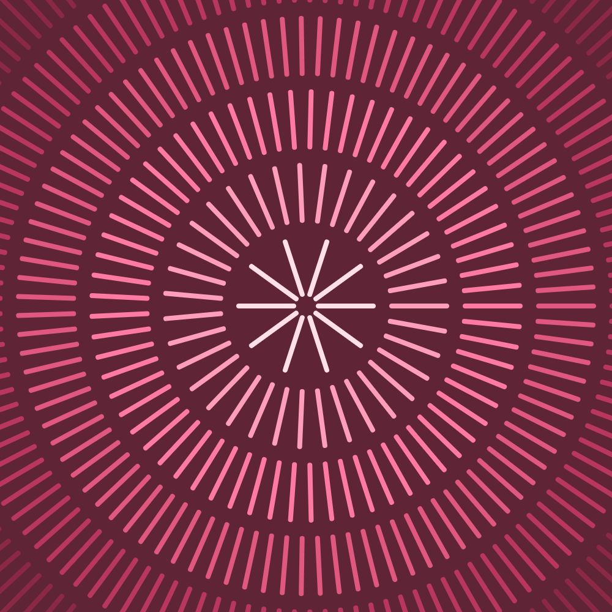

# 15 Days of Generative Art
I've been inspired to create a new piece of generative art every day for the 
these next few weeks. This combines my interests in computer science,
mathematics, and art/design and hopefully, I can create some pieces that I am
proud of.

P.S. I am following tutorials to create most of these pieces so I am in no way
claiming these ideas as my own; rather, I am using these tutorials because I
admire the work and want to create a similar piece by myself. The links to the
tutorials are in the `script.js` file in each of the day's folders.

## Day 1

## Day 2

## Day 3

## Day 4

## Day 5

## Day 6

## Day 7

## Day 8

## Day 9

## Day 9
